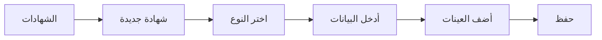
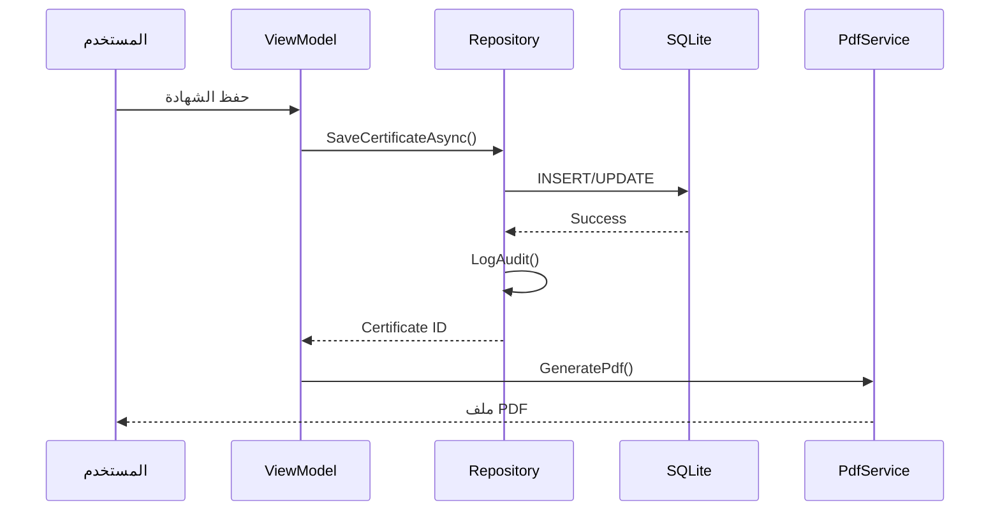
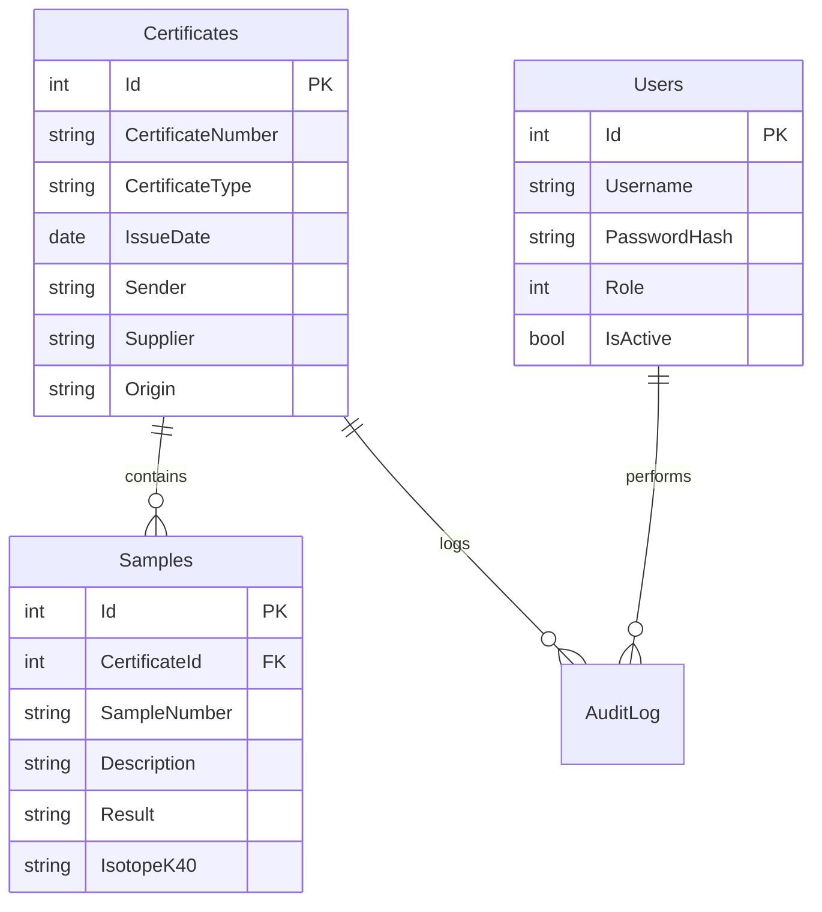

# الوثيقة الفنية والتقنية الشاملة
## منظومة إصدار الشهادات الإشعاعية

**الإصدار:** 1.0  
**تاريخ التوثيق:** 2025-12-26  
**المنصة:** Windows Desktop (WPF)

---

## 📋 جدول المحتويات

1. [مقدمة عن المنظومة](#1-مقدمة-عن-المنظومة)
2. [الهيكلية التقنية](#2-الهيكلية-التقنية)
3. [المكونات الأساسية](#3-المكونات-الأساسية)
4. [دليل الاستخدام](#4-دليل-الاستخدام)
5. [المخطط البياني للبيانات](#5-المخطط-البياني-للبيانات)
6. [المتطلبات والتشغيل](#6-المتطلبات-والتشغيل)
7. [الخاتمة والتطوير المستقبلي](#7-الخاتمة-والتطوير-المستقبلي)

---

## 1. مقدمة عن المنظومة

### 1.1 الهدف
منظومة متكاملة لإصدار وإدارة شهادات التحليل الإشعاعي للعينات البيئية والاستهلاكية، مصممة لتلبية احتياجات مختبرات الفحص الإشعاعي.

### 1.2 المشكلة التي تحلها

| المشكلة | الحل |
|---------|------|
| الإصدار اليدوي للشهادات | أتمتة كاملة مع قوالب PDF احترافية |
| صعوبة تتبع الشهادات | نظام بحث وفلترة متقدم |
| عدم وجود سجل للتعديلات | نظام تدقيق شامل (Audit Log) |
| فقدان البيانات | نسخ احتياطي تلقائي مع استعادة |
| صعوبة إعداد التقارير | تقارير تفاعلية مع تصدير Excel/PDF |

### 1.3 أنواع الشهادات المدعومة
- **شهادة تحليل عينات بيئية** - تتضمن النظائر المشعة (K40, Ra226, Th232, Raeq, Cs-137)
- **شهادة تحليل عينات استهلاكية** - تتضمن نتائج القياس بوحدة بيكريل/لتر-كجم

---

## 2. الهيكلية التقنية

### 2.1 نمط التصميم (Design Pattern)
```
┌─────────────────────────────────────────────────────────────┐
│                         MVVM Pattern                        │
├─────────────────────────────────────────────────────────────┤
│  View (XAML)  ←→  ViewModel (C#)  ←→  Model + Services     │
└─────────────────────────────────────────────────────────────┘
```

### 2.2 التقنيات المستخدمة

| التقنية | الإصدار | الوظيفة |
|---------|---------|---------|
| .NET | 8.0 | إطار العمل الأساسي |
| WPF | - | واجهة المستخدم |
| SQLite | 3.x | قاعدة البيانات المحلية |
| Material Design | 5.x | مكتبة التصميم |
| QuestPDF | 2024.x | توليد ملفات PDF |
| LiveCharts2 | 2.x | الرسوم البيانية |
| ClosedXML | 0.102.x | تصدير Excel |
| ZXing.Net | 0.16.x | توليد رموز QR |

### 2.3 بنية المشروع
```
Enjaz/
├── 📁 Assets/           # الصور والشعارات
├── 📁 Helpers/          # أدوات مساعدة (Converters, Commands)
├── 📁 Models/           # نماذج البيانات
├── 📁 Services/         # خدمات الأعمال
│   └── 📁 Repositories/ # طبقة الوصول للبيانات
├── 📁 Themes/           # ملفات السمات
├── 📁 Views/            # واجهات XAML
├── 📁 ViewModels/       # منطق العرض
├── App.xaml             # نقطة الدخول
└── App.xaml.cs          # تهيئة DI
```

---

## 3. المكونات الأساسية

### 3.1 النماذج (Models)

| النموذج | الوصف | الحقول الرئيسية |
|---------|-------|-----------------|
| `Certificate` | الشهادة | Id, CertificateNumber, Type, IssueDate, Samples |
| `Sample` | العينة | SampleNumber, Description, Result, Isotopes |
| `User` | المستخدم | Username, Role, IsActive, Permissions |
| `AuditLog` | سجل التدقيق | Action, Timestamp, UserId, Details |

### 3.2 الخدمات (Services)

| الخدمة | المسؤولية |
|--------|-----------|
| `DatabaseService` | إدارة قاعدة البيانات وإنشاء الجداول |
| `PdfService` | توليد شهادات PDF مع QR Code |
| `BackupService` | النسخ الاحتياطي التلقائي واليدوي |
| `UserService` | إدارة جلسة المستخدم الحالي |
| `ThemeService` | تبديل السمات والوضع الداكن |
| `ReportingService` | تجميع بيانات التقارير |
| `ExcelExportService` | تصدير البيانات لـ Excel |

### 3.3 المستودعات (Repositories)

| المستودع | العمليات |
|----------|----------|
| `CertificateRepository` | CRUD للشهادات + البحث + التدقيق |
| `UserRepository` | CRUD للمستخدمين + التحقق |

### 3.4 ViewModels

| ViewModel | الوظيفة |
|-----------|---------|
| `MainViewModel` | التنقل الرئيسي + Security Challenge |
| `LoginViewModel` | تسجيل الدخول |
| `DashboardViewModel` | لوحة المعلومات والإحصائيات |
| `CertificatesViewModel` | إدارة الشهادات الكاملة |
| `UsersViewModel` | إدارة المستخدمين والصلاحيات |
| `SettingsViewModel` | الإعدادات والنسخ الاحتياطي |
| `ReportingViewModel` | التقارير التفاعلية |

---

## 4. دليل الاستخدام

### 4.1 تسجيل الدخول
1. أدخل **اسم المستخدم** و **كلمة المرور**
2. اضغط **دخول**
3. البيانات الافتراضية: `admin` / `12345`

### 4.2 إصدار شهادة جديدة


### 4.3 البحث عن شهادة
- استخدم حقل البحث في أعلى القائمة
- يدعم البحث: رقم الشهادة، المورد، بلد المنشأ، الجهة المرسلة

### 4.4 طباعة/تصدير شهادة
1. اختر الشهادة من القائمة
2. اضغط على **عرض التفاصيل**
3. اختر: **طباعة** أو **حفظ PDF**

### 4.5 إدارة المستخدمين (للمدير فقط)
- إضافة/تعديل/تجميد المستخدمين
- تحديد الصلاحيات لكل مستخدم
- عرض سجل النشاط

### 4.6 النسخ الاحتياطي
- **تلقائي:** يتم حسب الإعدادات (يومي/أسبوعي/شهري)
- **يدوي:** من الإعدادات → نسخ احتياطي الآن

---

## 5. المخطط البياني للبيانات

### 5.1 تدفق إصدار الشهادة


### 5.2 هيكل قاعدة البيانات


---

## 6. المتطلبات والتشغيل

### 6.1 متطلبات النظام

| المتطلب | الحد الأدنى | الموصى به |
|---------|-------------|-----------|
| نظام التشغيل | Windows 10 | Windows 11 |
| المعالج | 2 GHz | 3 GHz+ |
| الذاكرة | 4 GB RAM | 8 GB RAM |
| التخزين | 500 MB | 1 GB+ |
| .NET Runtime | 8.0 | 8.0 |

### 6.2 التثبيت والتشغيل

**للتطوير:**
```powershell
cd "d:\منظومة شهادات جديدة 2026 جديدة"
dotnet restore
dotnet run
```

**للإنتاج:**
```powershell
dotnet publish -c Release -r win-x64 --self-contained
```

### 6.3 مسارات الملفات

| الملف | المسار |
|-------|--------|
| قاعدة البيانات | `%LocalAppData%\Enjaz\certificates.db` |
| الإعدادات | `%LocalAppData%\Enjaz\settings.json` |
| السجلات | `%LocalAppData%\Enjaz\Logs\` |
| النسخ الاحتياطي | المسار المحدد في الإعدادات |

---

## 7. الخاتمة والتطوير المستقبلي

### 7.1 نقاط القوة الحالية
- ✅ أمان عالي (PBKDF2 - 100,000 تكرار)
- ✅ واجهة عربية RTL كاملة
- ✅ سمات متعددة + وضع داكن
- ✅ نظام تدقيق شامل
- ✅ QR Code للتحقق

### 7.2 توصيات التطوير المستقبلي

| الأولوية | الميزة | الوصف |
|----------|--------|-------|
| 🔴 عالية | التحقق الإلكتروني | صفحة ويب للتحقق من صحة الشهادات عبر QR |
| 🟠 متوسطة | تقارير متقدمة | رسوم بيانية أكثر + مقارنات سنوية |
| 🟢 منخفضة | تطبيق موبايل | تطبيق للعرض والتحقق |
| 🟢 منخفضة | Unit Tests | اختبارات آلية للكود |
| 🟢 منخفضة | CI/CD | نشر تلقائي مع GitHub Actions |

### 7.3 الدعم الفني
للحصول على الدعم أو الإبلاغ عن مشاكل، يرجى التواصل مع فريق التطوير.

---

**© 2025 - جميع الحقوق محفوظة**
